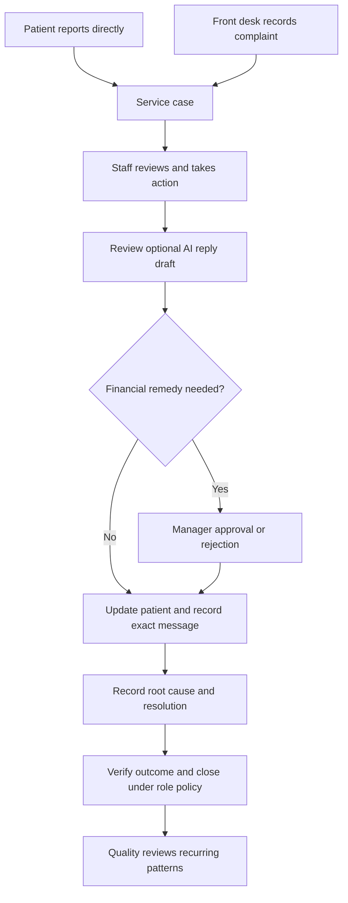

<div align="center">
  

# Chikitsa Follow

### Patient complaints. Accountable follow-up. Better hospital service.

An organization-aware service-recovery workspace for patients, front-desk teams,
branch managers, and quality leads.

**React + TypeScript** &nbsp; | &nbsp; **SELISE Blocks** &nbsp; | &nbsp; **English · বাংলা · Deutsch**

[Getting Started](#getting-started) · [Who Uses It](#who-uses-it) · [Workflow](#complaint-workflow) · [Release Status](#release-status)

</div>

---

## Why Hospitals Use It

Complaints handled only in conversation are difficult to follow up, measure, or
learn from. Chikitsa Follow brings the complaint, commitment, staff actions, and
patient communication into one service case.

| Hospital need | How the workspace helps |
| --- | --- |
| Consistent follow-up | Case ownership, status, deadlines, and action notes make outstanding work visible. |
| Patient confidence | Patients can follow their own cases and exchange messages with the service team. |
| Financial accountability | Refund requests require management review; approved manual payments can be recorded. |
| Meaningful resolution | Reporting distinguishes verified outcomes from cases that were merely closed. |
| Operational learning | Quality views compare branches and recurring complaint patterns. |
| Less fragmented work | Role-specific screens connect patient reporting, front-desk handling, and management review. |

These are intended operational benefits, not measured outcome claims. This is a
service-complaint application, not an electronic medical record or clinical tool.

## Who Uses It

| Role | Main workspace | Responsibilities |
| --- | --- | --- |
| Patient / family | My complaints, hospital selection, profile | Report a service problem, track progress, reply to the team, and maintain refund destinations. |
| Front-desk staff | Branch case list and work queues | Create cases, associate a patient email and hospital reference, review drafts, document actions, and communicate updates. |
| Branch manager | Branch performance and approval queue | Review cases, comment, approve or reject remedies, and verify outcomes. Managers do not create complaints. |
| Quality lead | Cross-branch performance and patterns | Compare recurring failures and review corrective actions without handling routine intake. |

Patient ownership is checked using the authenticated account. A hospital-issued
patient reference identifies a patient within a hospital; knowing that reference
does not grant access to someone else's complaint. See the [role matrix](ROLE-MATRIX.md).

## Complaint Workflow



This describes the intended operating flow. Enforcement gaps and pending live
checks are tracked in [implementation status](SRS-IMPLEMENTATION.md), not implied
to be complete by the diagram.

## Using The App

**Patients:** select a hospital during signup and complete the account activation
flow. In Profile, register the hospital-issued patient ID for each hospital you
use. Select the active hospital in the top bar, submit a service complaint, and
follow its status and conversation. Hospital selection separates complaint
context; it does not grant staff access. Patient IDs are currently self-reported,
not verified against a hospital registry.

**Front desk:** open the branch work queue, create a case with the patient's
email and hospital-issued reference, and record the category, severity, problem,
and commitment. Review any suggested reply before sending it. Add action notes,
follow up on deadlines, and record what the patient was actually told.

**Managers:** use branch performance, case history, and the remedy approval
queue. Review unresolved cases and verify outcomes; approval and recording a
manual payment are separate actions.

**Quality leads:** use cross-branch performance and recurring-pattern views to
investigate service failures and track corrective work.

**Everyone:** use Profile for account settings and the notification inbox for
updates. Delivery of automatic alerts requires the notification worker and
service credentials to be configured by the operator.

## Included Capabilities

- Organization-aware patient case lists, conversations, and hospital selection.
- Role-gated staff queues, case details, notes, approvals, and performance views.
- Encrypted bank, bKash, and Nagad refund destinations with a manual-refund workflow.
- Blocks IAM, Data Gateway, localization, and notifier integrations.
- Light and dark glass-inspired interface, medical branding, and an animated help robot.
- Reviewed service guidance and optional server-side Groq reply generation.
- English and Bangla dictionaries; partial German coverage and localized branding.

The help assistant currently uses reviewed topics, not a completed retrieval
system over hospital documents. It does not diagnose or access patient records.
Refund recording does not transfer money through a bank or mobile wallet.

## Getting Started

### Prerequisites

- Node.js 22.13+ with `node:sqlite` support; Node.js 24 is recommended for the private API.
- npm and access to a configured SELISE Blocks project.
- A registered public OIDC client and exact HTTPS callback URLs.
- Appropriate schemas, access policies, organization-to-branch mappings, and staff branch assignments.

### Install And Run

```bash
cd app
npm ci
cp .env.example .env
cp server/.env.example server/.env
npm run cert
npm run dev
```

Run the private API in a second terminal:

```bash
cd app
npm run start:api
```

Configure the public Blocks settings in `app/.env`. Configure server credentials,
allowed origins, encryption, and private storage in `app/server/.env` or a secret
manager. Neither file belongs in Git. All `VITE_` values are browser-visible:
never place passwords, provider keys, or service-client secrets there.

Hosted login needs HTTPS on the registered project domain, a trusted local
certificate, and an exact `/login/callback` registration. Follow the detailed
[frontend setup](app/README.md) and [private API setup](app/server/README.md).
A localhost preview alone does not validate the hosted login flow.

### Verify

```bash
cd app
npm test
npm run lint
npm run build
```

The `lint` script currently performs TypeScript checking. Automated tests do not
replace live role, organization-isolation, notification-delivery, or deployment tests.

## Architecture

```text
Browser: React / Vite / TanStack Query
  |-- Blocks SDK --> IAM, Data Gateway, Localization, Notifier
  |-- Same-origin /api --> Express private API
                            |-- authenticated case and hospital workflows
                            |-- encrypted persistent SQLite records
                            |-- optional Groq guidance and drafting
                            `-- notification worker using service credentials
```

| Location | Contents |
| --- | --- |
| `app/src/features/` | Patient, staff, management, quality, and assistant features |
| `app/src/lib/` | Shared Blocks client, authorization helpers, and localization |
| `app/server/` | Private API, encrypted persistence, and background notifications |
| `app/blocks/` | Blocks configuration and translation dictionaries |
| `app/public/` | Brand icons and web manifest |

## Release Status

**Development build; not yet signed off for production or real patient data.**

The current release review has these unresolved requirements:

- Configure and verify active complaint branches, hospital mappings, and staff branch assignments.
- Provision least-privilege service credentials for private ticket workflows and notifications.
- Deploy the private API alongside the frontend, with same-origin routing, durable private storage, and managed encryption keys.
- Verify cloud authorization and the complete workflow using every role on the deployed URL.
- Complete the requested live showcase seed, quality-chart review, and retrieval-based assistant work.

The frontend Docker image does not include the private API. A successful static
build is not an end-to-end deployment. See [release checks](RELEASE-CHECKLIST.md)
before publishing or deploying a release.

## Security And Data Boundaries

Do not enter diagnoses, test results, or other clinical content in service notes.
Content screening is a safeguard, not a guarantee. Browser permission checks are
not a substitute for server and Blocks data-access enforcement.

Private refund details are encrypted by the API. Production still requires secure
key custody, durable storage, backup and restore testing, retention rules, and an
authorization review. No HIPAA, GDPR, or other regulatory certification is claimed.

See [security guidance](SECURITY.md). Never publish demo passwords or operational
credentials, and rotate any credential previously exposed in a conversation or log.

## Documentation

- [System requirements](ChikitsaFollow-AI-Agent-SRS.md)
- [Design system](ChikitsaFollow-Design-System.md)
- [Implementation and outstanding gaps](SRS-IMPLEMENTATION.md)
- [Roles and permissions](ROLE-MATRIX.md)
- [Patient hospitals and identity](PATIENT-HOSPITALS.md)
- [Ticket ownership and conversations](PATIENT-TICKETS.md)
- [Refunds and notifications](REFUNDS-NOTIFICATIONS.md)

## License

No license has been selected. Public visibility alone does not grant permission
to redistribute or commercially reuse this software; contact the repository owner.
